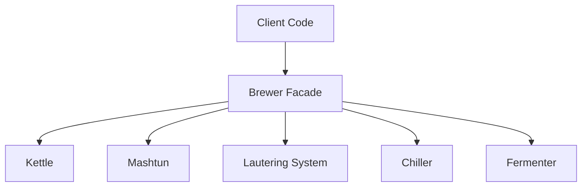

So lately I've been taking a hike off Mt. Dogma and re-approaching the Laravel projects I work with a fresh mind.
While
my time with Laravel has been relatively brief, finding my way to the framework sometime around 2022, I've been working
in other languages and ecosystems throughout my decade-ish long career as a software developer. My time in Java and .NET
in the mid-to-late aughts indoctrinated the principles of the enterprise that I still hold with me today. Though, this
isn't a blog post about SOLID, CUPID, or whatever the hell acronym we're going by these days.

When I'm really digging something, I like to write about it, and I'm long overdue for one of my internet programming
rambles on here on the homestead. Facades, and how they broke through my thick dependency injection framework-wired
brain, feels like the perfect topic at the moment.

TL;DR - I think I've truly found the _joy_ of using facades.

## What's in a facade?

Like all good stories, they start from the beginning. I keep my copy of the
holy [Gang of Four](https://en.wikipedia.org/wiki/Design_Patterns) texts within arm's reach in my office. When I'm
bored, or looking to jog my memory of why I was OOP-pilled in the first place, I crack it open to distract me from
providing shareholder value for 15 minutes or so every once in a while. There's structural pattern the gang writes about
called the [facade pattern](https://en.wikipedia.org/wiki/Facade_pattern) \*_foreshadowing intensifies_\*. If you want
the academic definition of it, it's a fascinating 30 minute read. I'll skip the ceremony of a lengthy explanation here
as there's no shortage of devs much more equipped in the noggin than myself that can explain the technical aspect of the
facade pattern.

For the regular Joes of us out there, facades enable working with complex objects easier. In plain english, a facade
is wrapper around a rather involved class, or set of classes, that provides simplified APIs to access the underlying
object(s), oftentimes easing the interaction for the outside world.

Taking a play out of the pretty much any "clean code"-esque style book, imagine we're writing software to help brewers
brew beer. Being a craft snob, I'm overdue for a good beer-based analogy. To brew a batch of the perfect programmer's
IPA, we've got a few moving pieces to handle:

- Heating water to a specific temperature
- Mashing grains and converting starches
- Lautering to separate wort from grain
- Boiling wort with hop additions at precise intervals
- Rapidly chilling the wort to yeast-safe temps
- Transferring to a fermenter
- Pitching yeast and managing fermentation

Modeling this interaction in code might look something like:

```php
$kettle->heatWater(155);
$mashtun->addGrains($recipe->grains);
$mashtun->holdTemp(60);
$lauteringSystem->run();
$kettle->boil(60);
$kettle->addHops($recipe->hops, $timingSchedule);
$chiller->coolTo(68);
$fermenter->transfer($kettle->getWort());
$fermenter->pitchYeast($recipe->yeast);
$fermenter->startFermentation();
```

We've got five actors in `$kettle`, `$mashtun`, `$lauteringSystem`, `$chiller`, `$fermenter` each seemingly with their
own dependencies and semantics. It would be much simpler if we could _just_ do something like:

```php
$breweryManager->brew($recipe);
```

That, more or less, is the facade pattern in a nutshell. You may often find it dressed up as a `BreweryManager`,
`BreweryService`, `BreweryOrchestrator`, or some other enterprise-y noun. But it all means the same thing: make a
complicated process simple.

## Laravel-izing

If you're using Laravel, chances are you're already familiar with a few of the facade centerpieces the framework offers:

- `Route`
- `Cache`
- `Config`
- `Validator`
- etc.

And if we give the same treatment to our conjured example of the brewery operations, we could use something like:

```php
Brewer::brew($recipe);
```

We're accomplishing the same thing, wrapping up a bunch of intertwined business logic in one call that coordinates
the work of brewing a recipe without the need of the caller to figure out which pieces are responsible for individual
parts of the recipe. That's the where the facade comes in, to make complex use cases of underlying services and logic
easy to use from the outsider's perspective.

## What makes up a facade

Let's zoom out from the code perspective and take a look at what a facade _might_ look like from a bird's eye view:



Our `Brewer` facade, in this case, coordinates the work between (betwixt?) the client code and the underlying
dependencies that are required to brew a recipe. Each of these services can themselves have additional dependencies,
idiosyncrasies, validation, and a litany of all sorts of things core business logic usually handles. From the client's
perspective, it doesn't care that our mashtun needs to hold a temperature of 60C to brew a recipe -- it just wants a
damn beer.

While you're typical Laravel-ian facade is simply just an access pattern for dependencies, nothing stops you from
writing your own facades that coordinate work from a complex service into a simple API for client's to consume.

## Facades in action

Laravel's [facade abstraction](https://github.com/laravel/framework/blob/c04df13f3b180b5889fbc4c2103f3a10035e501e/src/Illuminate/Support/Facades/Facade.php)
does a bunch of stuff under the covers, like caching, providing first-party defaults for services, and sets up testing
to name a few things. The most _interesting_ thing it does is in this
bit [here](https://github.com/laravel/framework/blob/c04df13f3b180b5889fbc4c2103f3a10035e501e/src/Illuminate/Support/Facades/Facade.php#L355):

```php
/**
 * Handle dynamic, static calls to the object.
 *
 * @param  string  $method
 * @param  array  $args
 * @return mixed
 *
 * @throws \RuntimeException
 */
public static function __callStatic($method, $args)
{
    $instance = static::getFacadeRoot();

    if (! $instance) {
        throw new RuntimeException('A facade root has not been set.');
    }

    return $instance->$method(...$args);
}
```

That's where the "magic" happens that you've probably seen developers arguing over the internet, giving weight to the
argument that Laravel's "magic" is a bit too magical at times. I'd argue the magic, at least in the case of facades,
is no more than a cheeky use of PHP's dynamic nature.

So there's nothing really "special" about facades. They resolve services from the container in a static fashion and shim
through calls to the underlying service.

To play devil's advocate -- yes, this is service locator in action. The older I get, however, I care less about
pattern-y type dogma and more about DX to simply get stuff done. I'll eat the fact that Laravel's going against the
software grain here, because after some time, I've really grown to love the ease of use facades bring to allow me to
simply just do the things I care about.

## With great power comes great responsibility

I'd wager the primary argument against the use of facades is their tendency to hide dependencies within a unit of work.
Take, for instance, some business logic-y type service/action that creates an account in a multi-tenant application:

```php
final class AccountManager
{
    public function create(string $tenantId, User $owner, array $tenantDetails): Account
    {
        // Do our DD and never trust the outside world
        $validated = Validator::make([...], $tenantDetails);

        // Call an external service because... reasons
        ExternalService::checkLegitness($owner);

        // Do some tenancy sanity checks
        Tenant::create([...]);

        // Post creation notifications
        Mail::to($owner)->sendNow(new NewTenantWelcomeEmail());

        // Create an audit trail for tracking
        Auditor::papertrail([...]);

    }
}
```

In our `create()` method alone, we have five dependencies, and nowhere in our calling surface do we specify that the
details of creating an account for a tenant do we specify to the outside world that these dependencies exist. If we
were to attempt to test this logic, we would need _some_ way to isolate the four dependencies and make them invariant
of the method itself. Sparing the jargin, we'd need a way to mock or provide fakes for these dependencies _if we're
testing this code in isolation_. A better test, in this case, would be a more e2e approach, where I'd expect:

- The actual validation to run
- A spied call out to our external service
- A tenant to exist in our test database
- An email to fire
- An audit record with updated values to exist in our test database

Bottom line, we're hiding a lot of abstraction. But what's the alternative? It might look something like:

```php
use App\Contracts\TenantManagerInterface;
use App\Contracts\AuditManagerInterface;
use App\Contracts\ExternalServiceInterface;
use Illuminate\Contracts\Mail\Factory as Mail;
use Illuminate\Contracts\Validation\Factory as Validator;

final class AccountManager
{
    public function __construct(
        private Validator $validator,
        private ExternalServiceInterface $externalService,
        private TenantManagerInterface $tenantManager,
        private Mail $mail,
        private AuditManagerInterface $auditManager,
    ) {
        //
    }

    public function create(string $tenantId, User $owner, array $tenantDetails): Account
    {
        // Do our DD and never trust the outside world
        $validated = $this->make([...], $tenantDetails);

        // Call an external service because... reasons
        $this->externalService->checkLegitness($owner);

        // Do some tenancy sanity checks
        $this->tenantManager->create([...]);

        // Post creation notifications
        $this->mail
            ->to($owner)
            ->sendNow(new NewTenantWelcomeEmail());

        // Create an audit trail for tracking
        $this->auditManager->papertrail([...]);
    }
}
```

Okay, so now at least we're communicating with the outside world that we _have_ dependencies. Furthermore, as we
inevitably continue to bloat this class due to unrealistic project deadlines and general laziness, we can use the
constructor as a litmus test of when a class needs to be filibustered. One can imagine that as the class grows in
complexity and needing more dependencies, we'll be in direct violation of most of the letters in SOLID.

Two paths that ultimately end up merging into the same road. But what about testing?

## Mock the pain away

As with any good bit of code, we need to validate its behavior. In the case of facades, we might have something like:

```php
#[CoversClass(AccountManager::class)]
final class AccountManagerTest extends TestCase
{
    private AccountManager $manager;

    public function setUp(): void
    {
        parent::setUp();

        //
        $this->manager = app(AccountManager::class);
    }

    #[Test]
    public function it_creates_an_account(): void
    {
        // Arrange
        Mail::fake();

        // No need to call the real service in a testing context
        ExternalService::fake([
            // Fake a few responses to get the behavior we'd expect
            ExternalServiceResponse::make([
                'is_legit' => true
            ])
        ]);

        // Act


        // Assert
    }
}
```
