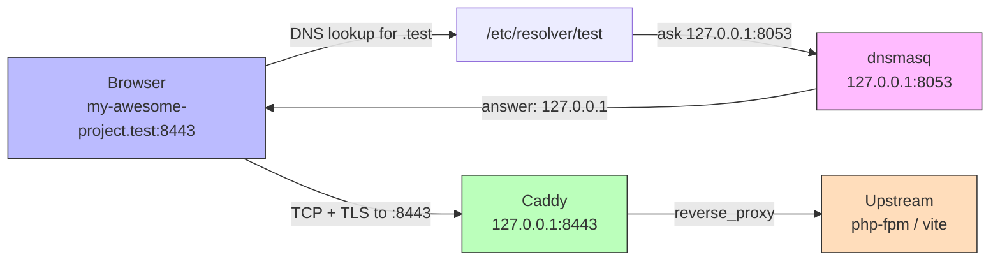

I've been on a spiritual journey this past year or so really tinkering with my dev workflow and spending
an alarming amount of time in dotfiles tweaking this or that. It started off with tmux a couple years
ago and multiple failures to launch trying to get myself using neovim. Once I got to the point where
I physically couldn't leave my terminal (cue the "stuck in vim" memes), I moved onto finding
terminal replacements for tools I use and pay for (most of the time, happily). A few notable ones:

- Postman => hurl
- JetBrains => neovim (btw)
- TablePlus => lazysql/harlequin

I'm happy with my setup that I've fine tuned for Laravel and PHP, but I wanted to take it one step
farther and see if I could home grow a Herd replacement to save yet another subscription. I should
preface that **you should use, and happily pay for, Herd**. It's hands down the best Laravel/PHP
get-your-project-off-the-ground tool out there right now (imo). You can fiddle with Docker containers,
tweak volumes paths, rage at how much storage Docker is filling up on your machine, etc. though Herd
is a one-time install that removes all the noise so you can focus on building stuff.

With that said, Herd can have some rough edges.

One of the things I've really embraced since letting Claude ~~run my life~~ help manage my workflow
is a worktree-first mindset allowing multiple agents to work on multiple things at once without
stepping on each other's robot toes. I even [wrote](/blog/wonderful-world-of-worktrees-and-laravel) about getting Herd setup for worktrees with the help of [worktrunk](https://worktrunk.dev/), another tool I've been
evangelizing to whoever will listen to me yap about it. While it's a fine solution (I think, at least),
it can always be made better. For example, your worktree setup has to know about Herd linking, which
configures nginx sites for you under the hood. That's global state as Herd has to run dnsmasq as root
to allow the use of portless `.test` domains. That's all fine, but a bit against the ethos of isolated
environments that worktrees aim to provide.

Another thing is global state, particularly with PHP and the associated services. In my experience,
Herd can often step on its own toes when spinning up services like FPM for specific versions of PHP.
If you're working on multiple projects across multiple PHP versions, or maybe the same project, but in a
branch/worktree that's upgrading a PHP version, you might run into port contention at some point and have
to do a round of process massacre to get back to a stable state.

These are **not Herd's fault** at all. This is a result of trying to wrangle processes all in coordination
on a machine, which has been a thorn in the side of developers for as long as we've been programming professionally.

There's alternatives, though. And one alternative I've been particularly keen on is [nix](https://nixos.org/) with [devenv](https://devenv.sh/).

## Going Herd-less

One of the great things Herd does is manage services like Redis, your databases (MySQL, Postgres, etc.),
Typesense, mail, and whole litany of stuff. Pretty much anything you need to run an app, Herd has a
managed process for it. One thing that I don't particularly _love_ about Herd, though, is how these services
are somewhat obfuscated from you and abstracted away. And rightfully so. I mean, we're building apps
and writing code (lmao, no we're not). I don't always want to deal with setting up databases and making sure
Redis is running. That's where Herd is _excellent_ for the DX, managing the stuff I don't really care about.

But sometimes, I do care about it. And the older I get, the more "control freak" I become where I want to
know exactly what's running in my dev environment at all times and how I can manage it.

That's where nix comes in. I won't go into much detail as I'm still a nix noob myself, but for what I'm using it
for, I can't see a world where I go back.

Nix provides a system for declarative system builds for whatever you need. It's like a `composer.json` or
`package.json` file but for your runtime environment. You tell nix that for a particular project you need PHP,
a specific version of it, what extensions you need, what database you need running, what version of Redis, etc.
You probably get the picture, but the biggest win is that these are defined in a file, that you can version control, tweak, manage, remove things, add services and tools, and anything else your project needs in its
environment to run. This alone is the perfect marriage for worktrees, where a worktree exists in _complete_
isolation from other worktrees where I'm free to tinker with its environment if I need to _without_ affecting
any other worktree. For example, if I'm doing a PHP 8.3 to PHP 8.4 upgrade, I keep `main` declaratively
pinned to 8.3, while my `feature/update-php-to-8.4` worktree branch pins itself to 8.4 with maybe a few
extra extensions and some `php.ini` tweaks and I can run both simultaneously in parallel without any headache.

[Devenv](https://devenv.sh/) is a layer that sits atop nix that makes it ridiculously simple to declare
what your project and environment needs to hit the ground running. All managed in a single `devenv.nix` file.
The real power here with devenv comes to light when taking a [bare repository layout](https://worktrunk.dev/tips-patterns/#bare-repository-layout) to your repository. What this means is instead of version controlled
project existing in a single folder where its `.git/` directory lives _within_ the repository folder itself,
you move `.git/` up a level as a sibling folder. This is perfect for worktree-driven development, as `.git/`
is global repository state, and all linked worktrees are just folders within a parent project folder. In practice,
this looks like:

```bash
my-awesome-project/
  .git/
  main/
  feature-foo-bar/
  fix-foo-baz/
```

Where `git switch` now becomes `cd` into whatever branch/worktree I need to be on. The git state is managed
globally among the worktrees, and there's no need for a dedicated worktrees folder where you might store
your worktrees.

Rewiring the ole noggin a bit, this approach to a project's version control goes hand-in-hand with
devenv, where each folder now gets its own runtime environment, from services, tools, secrets, etc.

But we're not exactly Herd-less yet. While devenv manages the things we need to run our apps, we still
need to see the dang thing run in a browser. That's where [Caddy](https://caddyserver.com/) comes in.

## Not your dad's web server

Caddy is the spiritual successor to nginx. It's fast, has a bunch of modern features, an nginx-like DSL,
written in go, etc. I'm not a caddy expert, I just need local reverse proxying. That's what caddy helps
accomplish akin to how Herd uses nginx to forward those `my-awesome-project.test` requests to the correct
running instance of the app locally. For example, the caddy file for my website here looks like this:

#### joeymckenzie.tech.test.caddy

```caddy
joeymckenzie.tech.test:8443 {
    tls internal

    @websocket {
        header Connection *Upgrade*
        header Upgrade websocket
    }
    handle @websocket {
        reverse_proxy 127.0.0.1:5273
    }

    @vite path /@vite/* /@id/* /@fs/* /@react-refresh /resources/* /node_modules/* /__laravel_vite_plugin__/*
    handle @vite {
        reverse_proxy 127.0.0.1:5273
    }

    handle {
        reverse_proxy 127.0.0.1:8100
    }
}
```

I keep all my caddy sites in my `~/.config/devenv/sites` folder and wire them up in a `~/.config/devenv/Caddyfile` like so:

#### `~/.config/devenv/Caddyfile`

```caddyfile
{
 auto_https disable_redirects
}

import sites/*.caddy
```

So when I drop into my devenv shell with caddy running, it knows to import all the websites I have wired
up in that `sites/` folder and routes each one accordingly. The flip side to that coin is [dnsmasq](https://thekelleys.org.uk/dnsmasq/doc.html) which Herd also uses under the hood. I declare dnsmasq in my `devenv.nix` file (we'll get to that in a minute), and wire up an `/etc/resolver/test` file that points DNS lookups
for `.test` domains to `127.0.0.1`, also lovingly known as localhost:

#### `/etc/resolver/test`

```bash
nameserver 127.0.0.1
port 8053
```

The port 8053 here is where dnsmasq runs. The browser essentially asks "hey, what's the IP for this `.test` domain?" Dnsmasq answers that question with "go to `127.0.0.1`, buddy." The browser then opens a TCP connection to `127.0.0.1:8443` (the port came from the URL, not DNS), where caddy is camped out waiting. Caddy picks the request up, terminates TLS, and forwards it to whichever upstream the matching site block points to (e.g. the caddy file wired up to the domain). Herd/Valet, yet again, does this for you so you don't have to worry
about DNS. Because when something breaks... it's somehow _always_ DNS.

Visually, the request flow looks like this:



The primary difference between running your
own setup with devenv, caddy, and dnsmasq and Herd is that Herd runs those processes as root, where devenv does not. Port 443 is a restricted port, so if you're not root, the system more than likely won't let you scoop it (unless you port forward, but I don't care enough to do that). The tradeoff here is that we have to hit `my-awesome-project.test:8443` instead of just `my-awesome-project.test`. That's something I'm willing to live with,
but you should take that into account should you decide to venture into the deep waters of Herd-less Laravel local dev.

## Declarative nix files

Okay, that's enough networking for the week. Now to the fun stuff, actually running devenv. For a full-fledged
Laravel app, we need a few things going for us:

- We need PHP and JavaScript (obviously)
- We need environment variables
- We need queues, so Redis
- We need a database: MySQL, Postgres, SQLite, etc.
- We might want full-text search with meilisearch or typesense
- Feature flags with LaunchDarkly
- Any other service that our app needs to run

And that's where nix joins us, to set those things up for us in an isolated development shell, hidden from
the outside world. The devenv [docs](https://devenv.sh/getting-started/) will do a better job of getting
you setup with nix and devenv than I ever will, so I highly encourage you to give them a quick once over.

Within a project, you can run `devenv init` to get a pretty bare bones setup for a `devenv.nix` file:

```nix
{ pkgs, lib, config, inputs, ... }:

{
  # https://devenv.sh/basics/
  env.GREET = "devenv";

  # https://devenv.sh/packages/
  packages = [ pkgs.git ];

  # https://devenv.sh/languages/
  # languages.rust.enable = true;

  # https://devenv.sh/processes/
  # processes.dev.exec = "${lib.getExe pkgs.watchexec} -n -- ls -la";

  # https://devenv.sh/services/
  # services.postgres.enable = true;

  # https://devenv.sh/scripts/
  scripts.hello.exec = ''
    echo hello from $GREET
  '';

  # https://devenv.sh/basics/
  enterShell = ''
    hello         # Run scripts directly
    git --version # Use packages
  '';

  # https://devenv.sh/tasks/
  # tasks = {
  #   "myproj:setup".exec = "mytool build";
  #   "devenv:enterShell".after = [ "myproj:setup" ];
  # };

  # https://devenv.sh/tests/
  enterTest = ''
    echo "Running tests"
    git --version | grep --color=auto "${pkgs.git.version}"
  '';

  # https://devenv.sh/git-hooks/
  # git-hooks.hooks.shellcheck.enable = true;

  # See full reference at https://devenv.sh/reference/options/
}
```

This is a basic devenv nix file. The nix DSL is pretty human friendly, but there's a whole language
manual worth a lazy Sunday afternoon read. A nix file is basically a recipe to tell nix how to construct
the development shell you'll be working in, declaring what languages, tools, and services you might need
to get the project running.

That `{ pkgs, lib, config, inputs, ... }:` block at the top of the file is an entry point for nix, of sorts,
that kind of acts like a function signature. This is saying "I need the nix built-in modules for `pkgs`, `lib`, `config`, and `inputs`",
where our recipe uses these to hook in the things we need.

The rest of the scope block, or the stuff in between the brackets, is just a recipe for how to build
this dev shell. We assign an env var for the environment, wire up git as a tool for us to be able to use,
build out some arbitrary scripts to execute, and some hooks for when we enter the dev shell that'll
run some arbitrary commands as well as a hook for when we want to specifically run tests on this shell.

## Laravel-ization

Now we need to Laravel-ize it. First, we get rid of everything so we can work from a clean slate.
For my setup, I only use `pkgs` and `libs` as the named arguments as I don't need `config` or `inputs`:

```nix
{ pkgs, lib, ... }:
```

Next, we need some variables to pass around for the app setup for the common things we'll be reusing:

```nix {}{3-25}
{ pkgs, lib, ... }:

let
  worktreeName = builtins.baseNameOf (toString ./.);

  indexFile = ./.devenv-index;
  index =
    if builtins.pathExists indexFile then
      lib.toInt (lib.removeSuffix "\n" (builtins.readFile indexFile))
    else
      0;

  appPort = 8000 + index;
  vitePort = 5173 + index;
  xdebugPort = 9003 + index;
  dbName = "my_awesome_project_" + lib.replaceStrings [ "-" "." ] [ "_" "_" ] worktreeName;
  hostname = if worktreeName == "main" then "my-awesome-project.test" else "${worktreeName}.my-awesome-project.test";

  toolsPath = /. + "${builtins.getEnv "HOME"}/.config/devenv/tools.nix";
in
{
  # TODO
}
```

The `let` binding functions pretty much like any other programming language that supports block-level
assignments, just declaring a bunch of variables in a block to reuse. I use a few things here:

- Because I use worktrees primarily, the `worktreeName` is just a reference to the current folder I'm in
- I use index files that simply just hold a single number that gets parsed into a value that gets used to deterministically bump ports so worktrees don't collide with one another (poor man's implementation of port hashing)
- I assign port values based on the port index (`main` has a port index of 0, as it's the trunk branch)
- Subsequent worktrees get values of 1, 2, 3, and so on (again, there's probably a better way to do this)
- I hold a reference to the database name this worktree will use
- I grab the hostname this worktree will run under as well
- I reference a path to the common tools I use for all my nix files that I version control in my dotfiles

## Sharing tools

For that last reference there, I keep a `tools.nix` file that acts as a common set of shared tools that,
more often than not, any dev shell I'm working will need:

#### ~/.config/devenv/tools.nix

```nix
{ pkgs, ... }:
{
  packages = with pkgs; [
    git
    curl
    gh
    jq
    ripgrep
    fd
    fzf

    nil
    statix
    deadnix
    nixfmt-rfc-style

    sqlite
    pgcli
    mycli
    litecli
  ];
}
```

I use a few terminal tools, CLIs, and some nix stuff. I tend to keep language stuff out since this is meant
to be used by any project that I use nix/devenv with.

## Declaring the important stuff

Okay, with that out of the way, let's get into the meat and potatoes of my `devenv.nix` recipe:

```nix {}{20-55}
{ pkgs, lib, ... }:

let
  worktreeName = builtins.baseNameOf (toString ./.);

  indexFile = ./.devenv-index;
  index =
    if builtins.pathExists indexFile then
      lib.toInt (lib.removeSuffix "\n" (builtins.readFile indexFile))
    else
      0;

  appPort = 8000 + index;
  vitePort = 5173 + index;
  xdebugPort = 9003 + index;
  dbName = "my_awesome_project_" + lib.replaceStrings [ "-" "." ] [ "_" "_" ] worktreeName;
  hostname = if worktreeName == "main" then "my-awesome-project.test" else "${worktreeName}.my-awesome-project.test";

  toolsPath = /. + "${builtins.getEnv "HOME"}/.config/devenv/tools.nix";
in
{
  imports = [ toolsPath ];

  dotenv.disableHint = true;

  languages.php = {
    enable = true;
    version = "8.4";
    extensions = [
      "redis"
      "pdo_pgsql"
      "pgsql"
      "intl"
      "bcmath"
      "gd"
      "zip"
      "xdebug"
    ];
    ini = ''
      ${builtins.readFile ./php.ini.base}
      xdebug.client_port = ${toString xdebugPort}
      ${lib.optionalString (builtins.pathExists ./php.local.ini) (builtins.readFile ./php.local.ini)}
    '';
  };

  languages.javascript = {
    enable = true;
    package = pkgs.nodejs_22;
    npm.enable = true;
  };

  packages = with pkgs; [
    postgresql_16
    redis
  ];
}
```

The `in` block captures over variables in the `let` block where I'm now telling nix that I need a few things
in my dev environment:

- Import the common tools for terminal stuff I'll be doing
- Disable `.env` warnings (more on this later)
- Wire up PHP for me, complete with companion `php.ini.base` file that can optionally resolve values from a `php.local.ini` file, if needed
- Wire up node for me (so long, 10 different ways to manage node versions)
- Include Postgres and Redis since Laravel needs the drivers available

## Spinning up dev servers

These represent core tools I need to actually do stuff with Laravel. This is great, but we actually have to
_run_ the app at some point. So, let's define what processes devenv can spin up when I boot up the environment:

```nix {}{56-67}
{ pkgs, lib, ... }:

let
  worktreeName = builtins.baseNameOf (toString ./.);

  indexFile = ./.devenv-index;
  index =
    if builtins.pathExists indexFile then
      lib.toInt (lib.removeSuffix "\n" (builtins.readFile indexFile))
    else
      0;

  appPort = 8000 + index;
  vitePort = 5173 + index;
  xdebugPort = 9003 + index;
  dbName = "my_awesome_project_" + lib.replaceStrings [ "-" "." ] [ "_" "_" ] worktreeName;
  hostname = if worktreeName == "main" then "my-awesome-project.test" else "${worktreeName}.my-awesome-project.test";

  toolsPath = /. + "${builtins.getEnv "HOME"}/.config/devenv/tools.nix";
in
{
  imports = [ toolsPath ];

  dotenv.disableHint = true;

  languages.php = {
    enable = true;
    version = "8.4";
    extensions = [
      "redis"
      "pdo_pgsql"
      "pgsql"
      "intl"
      "bcmath"
      "gd"
      "zip"
      "xdebug"
    ];
    ini = ''
      ${builtins.readFile ./php.ini.base}
      xdebug.client_port = ${toString xdebugPort}
      ${lib.optionalString (builtins.pathExists ./php.local.ini) (builtins.readFile ./php.local.ini)}
    '';
  };

  languages.javascript = {
    enable = true;
    package = pkgs.nodejs_22;
    npm.enable = true;
  };

  packages = with pkgs; [
    postgresql_16
    redis
  ];

  processes.app.exec = "php artisan serve --host=127.0.0.1 --port=${toString appPort}";
  processes.queue.exec = "php artisan queue:listen --tries=1";
  processes.logs.exec = "php artisan pail --timeout=0";
  processes.horizon.exec = "php artisan horizon";
  processes.vite.exec = "npm run dev -- --port ${toString vitePort} --strictPort";

  processes.migrate = {
    exec = "php artisan migrate --force";
    process-compose.availability.restart = "no";
  };
  processes.app.process-compose.depends_on.migrate.condition = "process_completed_successfully";
  processes.horizon.process-compose.depends_on.migrate.condition = "process_completed_successfully";
  processes.queue.process-compose.depends_on.migrate.condition = "process_completed_successfully";
}
```

I tell devenv that when I boot up the environment with `devenv up` (akin to a good ole fashioned `docker compose up`), I need to run a few processes:

- Laravel's built-in dev server on the port we computed for the worktree
- The queue workers
- Tail logs with `pail`
- Horizon, because you should be running Horizon
- Boot up the vite dev server
- Run any pending migrations
- And lastly through [process-compose](https://f1bonacc1.github.io/process-compose/), I gate the app, queue, and Horizon processes from running until migrations have successfully applied

One little block does everything I need all at once. All in a day's work 😅.
One thing to note is that devenv uses [process-compose](https://f1bonacc1.github.io/process-compose/) as a
supervisor of sorts to manage the fleet of related processes. Getting familiar with it is well worth while
and a welcome alternative to those that want a Docker-like experience with bare metal processes. As of devenv 2.0, though, they've replaced process-compose with a native version, but with a compat layer so old stuff doesn't break.

## Setting the environment

At some point, we're gonna need environment variables. Luckily, devenv can handle that for us.

Because I take a worktree first approach, I need to change a few things so the environment is properly
set for Laravel. There's a bit of contention here, as Laravel wants to manage its own environment through
a `.env` file. Devenv can inject environment variables into the dev shell too, and ultimately only one variable
can win the race (condition). For worktrees, I think of it like this:

- If the environment variable is dynamic, put it in `devenv.nix`
- If the environment variable is static, keep it in `.env`

For a basic Laravel app, this means we need to keep a few variables managed by `devenv.nix`, namely:

- APP_URL: The URL we use here will be specific to the domain the worktree is using
- APP_PORT: Each worktree gets it's own server port
- DB_DATABASE: We don't want worktrees muddying up data between themselves
- REDIS_DB: Same idea as above, we don't want stale caches between trees OR jobs pulling off the wrong queue (if using Redis as the queue driver)
- XDEBUG_PORT: Nice to have to run xdebug among multiple trees if needed

Simply enough, we can set these directly in our `devenv.nix`:

```nix {}{71-77}
{ pkgs, lib, ... }:

let
  worktreeName = builtins.baseNameOf (toString ./.);

  indexFile = ./.devenv-index;
  index =
    if builtins.pathExists indexFile then
      lib.toInt (lib.removeSuffix "\n" (builtins.readFile indexFile))
    else
      0;

  appPort = 8000 + index;
  vitePort = 5173 + index;
  xdebugPort = 9003 + index;
  dbName = "my_awesome_project_" + lib.replaceStrings [ "-" "." ] [ "_" "_" ] worktreeName;
  hostname = if worktreeName == "main" then "my-awesome-project.test" else "${worktreeName}.my-awesome-project.test";

  toolsPath = /. + "${builtins.getEnv "HOME"}/.config/devenv/tools.nix";
in
{
  imports = [ toolsPath ];

  dotenv.disableHint = true;

  languages.php = {
    enable = true;
    version = "8.4";
    extensions = [
      "redis"
      "pdo_pgsql"
      "pgsql"
      "intl"
      "bcmath"
      "gd"
      "zip"
      "xdebug"
    ];
    ini = ''
      ${builtins.readFile ./php.ini.base}
      xdebug.client_port = ${toString xdebugPort}
      ${lib.optionalString (builtins.pathExists ./php.local.ini) (builtins.readFile ./php.local.ini)}
    '';
  };

  languages.javascript = {
    enable = true;
    package = pkgs.nodejs_22;
    npm.enable = true;
  };

  packages = with pkgs; [
    postgresql_16
    redis
  ];

  processes.app.exec = "php artisan serve --host=127.0.0.1 --port=${toString appPort}";
  processes.queue.exec = "php artisan queue:listen --tries=1";
  processes.logs.exec = "php artisan pail --timeout=0";
  processes.horizon.exec = "php artisan horizon";
  processes.vite.exec = "npm run dev -- --port ${toString vitePort} --strictPort";

  processes.migrate = {
    exec = "php artisan migrate --force";
    process-compose.availability.restart = "no";
  };
  processes.app.process-compose.depends_on.migrate.condition = "process_completed_successfully";
  processes.horizon.process-compose.depends_on.migrate.condition = "process_completed_successfully";
  processes.queue.process-compose.depends_on.migrate.condition = "process_completed_successfully";

  env = {
    APP_URL = "https://${hostname}:8443";
    APP_PORT = toString appPort;
    DB_DATABASE = dbName;
    REDIS_DB = toString index;
    XDEBUG_PORT = toString xdebugPort;
  };
}
```

The `env` block uses the `let` bindings to create those variables Laravel expects to be in place when
caching its config on first boot. This means **you should remove these from `.env`** so they don't collide
with the value managed by devenv for the worktree.

## Shell hooks

# TODO
